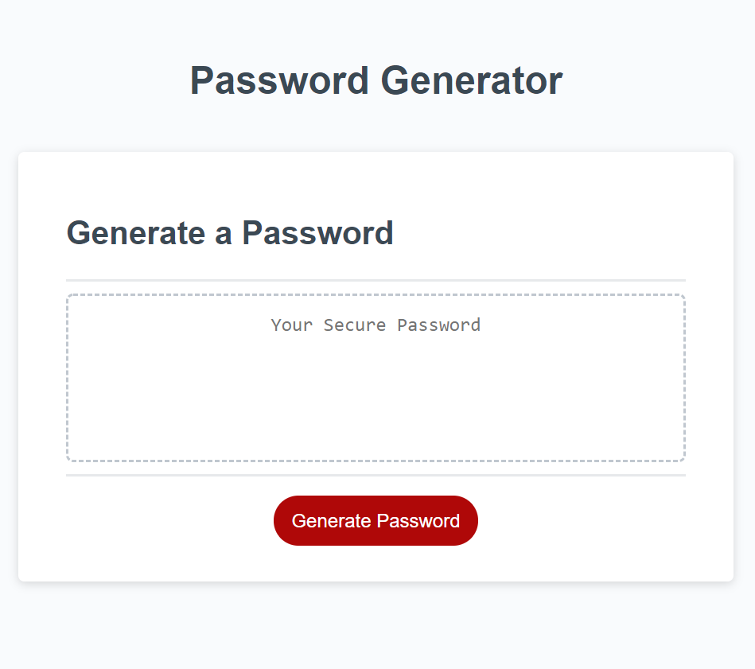

# The Password-Generator 🖥️🔑

***

 

## Description

Being provided with an already-created HTML and CSS file, I was tasked to add functionality to the website using a JavaScript file in order for a password to be generated.

Please click [here](https://christina2021.github.io/Password-Generator/) to check out this site! 

## Usage

When the "Generate Password" button is clicked 🖱️, the user will be alerted that there will be a series of pop-ups to select the criteria for their password (the length and the character types for the password).  The criteria that the user may select from includes:\
⭐The first prompt will ask the user to select how many characters to include in their new password (with a minimum of 8 characters and maximum of 128).\
⭐The second pop-up will ask the user if they would like to include lowercase letters in their password.\
⭐The third pop-up will ask the user if they would like to include uppercase lettters in their password.\
⭐The fourth pop-up will ask the user if they would like to include numbers in their password.\
⭐The fifth/final pop=up will ask the user if they would like to include special characters in their password.\
Once the user has selected their criteria, a new password will generate in the textarea on the webpage.

#### Notes on Usage
📝If the user does not select a whole number bewtween 8-128 on the first prompt, then they will receive an alert (in which they cannot move onto the next prompt until a valid section here has been made).\
📝If the user does not confirm any of the character type pop-ups (the 2nd thru fifth options from above), then they will receive an alert, and will be brought back to the lowercase.\
📝If the user had already generated a password and clicks the "Generate Password" button again, a pop-up will ask the user if they're sure that they want to create another password.\

## What I Learned 💭
For one of the parts of my code, I had made it so that all character types that the user had chosen would be combined into one array.  What I had realized later is that while the characters picked from this array would be random, it may not always meet the specific criteria that the user selected (for example, if the user selects for lowercase letters and numbers, there is a chance that the password generated will be all lowercase letters and have no numbers).  To fix this, I had added to the code a way for the password to be checked against each criterion that the user selected.  If the password ended up not including a specific criterion, then a new password would generate (in which this would continue until the password that is generated meets all criteria that the user had picked).\
I also found myself repeating multiple lines of codes when character types needed to be added to an array that the password characters would be picked from, as well as when the password was checked for each criterion.  I was able to condense the code down into functions when this happened.

## Acknowledgements

As always, discussions with my awesome study group on different JavaScript topics had helped me think of new ideas to put towards my code!

## License
[MIT](https://choosealicense.com/licenses/mit/#)